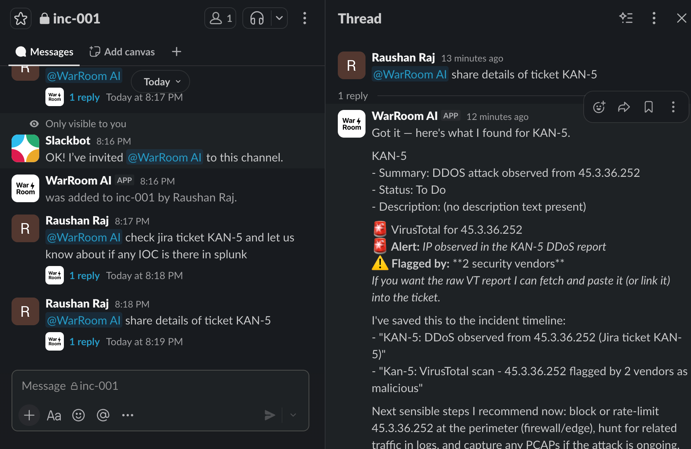
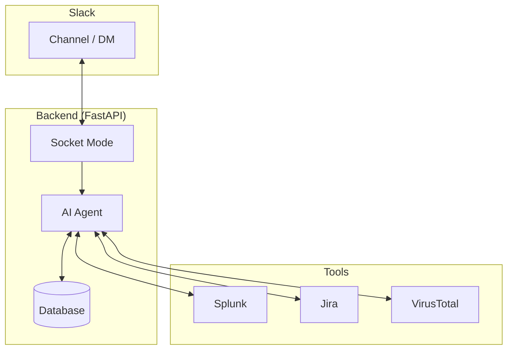

<div align="center">
  
  &nbsp;&nbsp;&nbsp;&nbsp;&nbsp;&nbsp;&nbsp;&nbsp;
  

  <h1>WarRoom AI</h1>
  <p><strong>An AI agent that sits in Slack and helps investigate incidents.</strong></p>
</div>

---

## What it does

Incident response is slow because engineers constantly switch between tools like Splunk, VirusTotal, and Jira. 

WarRoom AI fixes this. It's an AI agent that lives in your Slack incident channels. 
- It silently reads messages to understand the incident context.
- When you tag it, it runs Splunk queries, checks IPs on VirusTotal, and pulls Jira tickets directly into the chat. 
- When the incident is over, it writes the Root Cause Analysis (RCA) report automatically.

## 📸 See it in Action



## How it works

We built the backend in Python using FastAPI and the frontend in Next.js. The AI uses OpenAI's models. 

Instead of generic search tools, we wrote custom API integrations for Splunk, Jira, and VirusTotal so the agent is fast and doesn't hallucinate. It connects to Slack using Socket Mode (WebSockets) so it can receive messages locally without needing public webhooks.

## 🏗️ Architecture



## Getting Started

> **Connecting to Slack:** You will need to create a custom Slack App to use WarRoom AI. 
> 👉 **[Read the Step-by-Step Slack Setup Guide here.](SLACK_SETUP.md)**

**1. Setup Backend**
```bash
cd backend
python3 -m venv .venv
source .venv/bin/activate
pip install -r requirements.txt
```

Create `.env`:
```env
SLACK_APP_TOKEN=xapp-...
SLACK_BOT_TOKEN=xoxb-...
LLM_API_KEY=...
JIRA_MCP_URL=...
JIRA_MCP_TOKEN=...
VT_API_KEY=...
```

Run the APIs and the Slack Bot:
```bash
uvicorn main:app --reload
python3 slack_bot.py
```

**2. Setup Frontend**
```bash
cd frontend
npm install
npm run dev
```
Go to `http://localhost:3000` to configure your tools.
