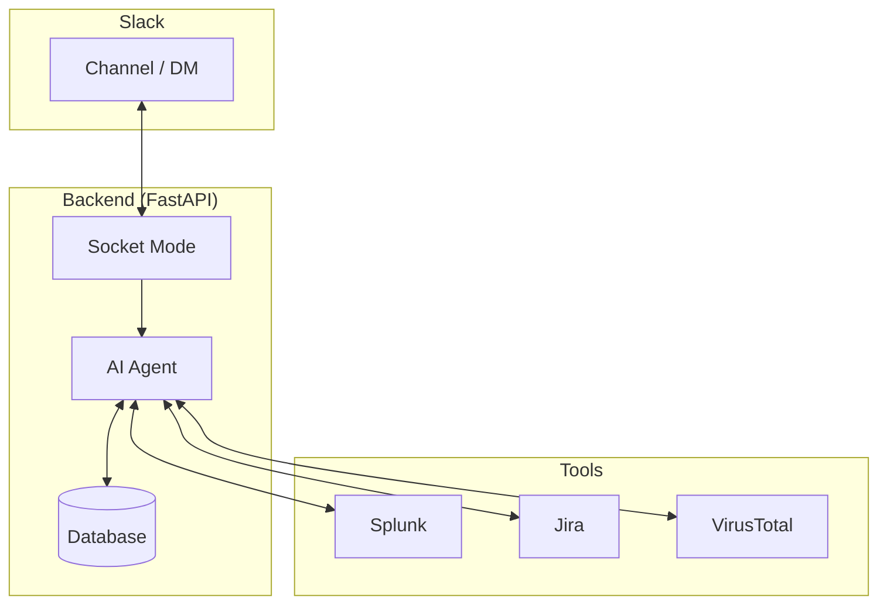
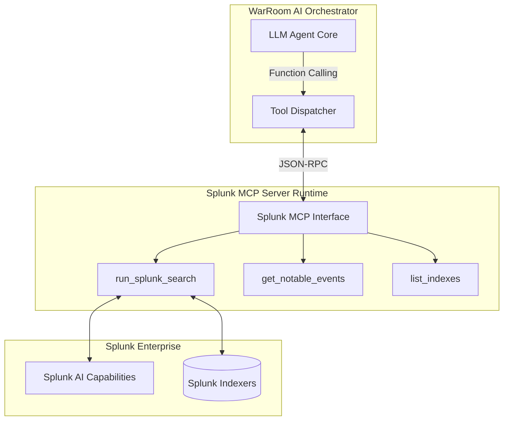
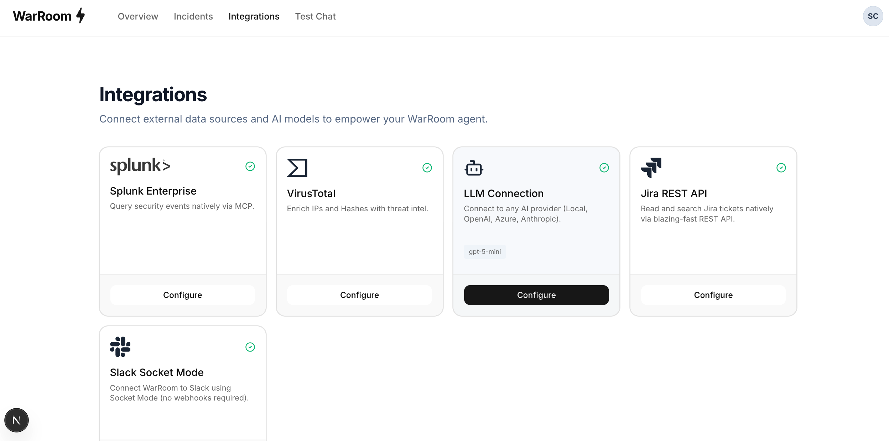

<div align="center">
  
  &nbsp;&nbsp;&nbsp;&nbsp;&nbsp;&nbsp;&nbsp;&nbsp;
  

  <h1>WarRoom AI</h1>
  <p><strong>An AI agent that sits in Slack and helps investigate incidents.</strong></p>
</div>

---

## What it does

Incident response is slow because engineers constantly switch between tools like Splunk, VirusTotal, and Jira. 

WarRoom AI fixes this. It's an AI agent that lives in your Slack incident channels. 
- It silently reads messages to understand the incident context.
- When you tag it, it runs Splunk queries, checks IPs on VirusTotal, and pulls Jira tickets directly into the chat. 
- When the incident is over, it writes the Root Cause Analysis (RCA) report automatically.

## 📸 See it in Action


## How it works

We built the backend in Python using FastAPI and the frontend in Next.js. The AI uses OpenAI's models. 

**This project explicitly uses Splunk's AI capabilities and the Splunk MCP (Model Context Protocol) Server at runtime.** 

Instead of generic search tools, the AI Agent connects dynamically to the **Splunk MCP Server** to run real-time queries and parse threat intel natively. It connects to Slack using Socket Mode (WebSockets) so it can receive messages locally without needing public webhooks.

## 🏗️ Core Architecture



## 🧠 Splunk MCP & AI Capabilities

WarRoom AI deeply integrates with Splunk MCP to give the LLM agent runtime access to your Splunk Enterprise logs and AI features.



**Agent Tool Capabilities Fetched via MCP:**
- `run_splunk_search`: The agent dynamically writes and executes complex SPL queries against Splunk data.
- `get_notable_events`: The agent natively fetches notable security events and alerts.
- `list_indexes`: The agent discovers what data is available to query before making assumptions.

## 🔌 Plug-and-Play Integrations UI

Configuring enterprise integrations shouldn't require manually editing config files. WarRoom AI includes a sleek, dedicated web dashboard to seamlessly configure your Splunk MCP Server, Jira credentials, and Slack Socket Mode tokens.


*(Above: The WarRoom Dashboard where analysts can securely connect the Splunk MCP Server and other tools to the AI Agent.)*

## Getting Started

> **Connecting to Slack:** You will need to create a custom Slack App to use WarRoom AI. 
> 👉 **[Read the Step-by-Step Slack Setup Guide here.](SLACK_SETUP.md)**

**1. Setup Backend**
```bash
cd backend
python3 -m venv .venv
source .venv/bin/activate
pip install -r requirements.txt
```


Run the APIs and the Slack Bot:
```bash
uvicorn main:app --reload
python3 slack_bot.py
```

**2. Setup Frontend**
```bash
cd frontend
npm install
npm run dev
```
Go to `http://localhost:3000` to configure your tools.
