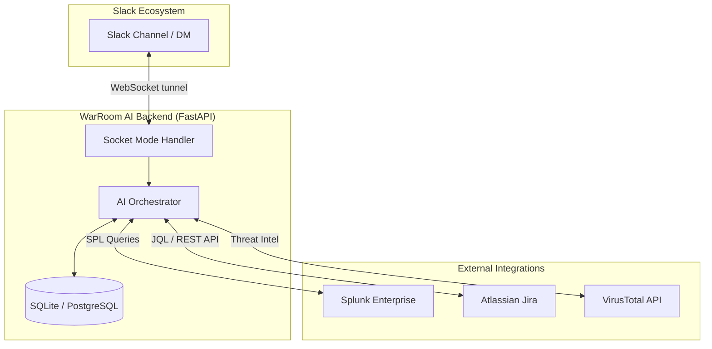

<div align="center">
  
  &nbsp;&nbsp;&nbsp;&nbsp;&nbsp;&nbsp;&nbsp;&nbsp;
  

  <h1>WarRoom AI</h1>
  <p><strong>An Autonomous AI-Powered Incident Response Slack App for Splunk</strong></p>
</div>

---

## 🚀 Overview

**WarRoom AI** is a collaborative incident response workspace and intelligent Slack bot designed to supercharge SOC teams. When a major security incident occurs, analysts waste precious time jumping between Splunk for logs, VirusTotal for threat intel, Jira for ticketing, and Slack for communication.

WarRoom AI acts as an elite SOC colleague. It sits natively inside your incident Slack channels, silently reading the context of the breach, and leaps into action when tagged—executing SPL queries, scanning IPs, fetching Jira tickets, and generating highly structured Root Cause Analyses (RCA) on command.

## 📸 See it in Action


*(Above: WarRoom AI instantly fetching Jira tickets, analyzing VirusTotal IoCs, and providing actionable SOC recommendations directly inside Slack)*

## ✨ Key Features

- **Silent Passive Ingestion:** When invited to a Slack incident channel, WarRoom AI silently listens and records context to its database, natively building a timeline of the incident without spamming the channel.
- **Active Slack Bot (Socket Mode):** Built with `slack_bolt`, the bot uses WebSocket tunnels (Socket Mode) for instantaneous communication without requiring exposed public webhooks. 
- **Blazing-Fast Integrations:**
  - **Splunk MCP Server:** Connects directly to Splunk to execute complex SPL queries and retrieve live logs.
  - **Jira Cloud REST API:** Natively searches and parses Jira tickets (e.g., `KAN-5`) using ultra-low latency JQL execution.
  - **VirusTotal v3:** Automatically intercepts any IP or domain mentioned in chat and scans it for malicious threat intel.
- **Automated RCAs:** Ask `@WarRoom` to generate an RCA, and it instantly drops a beautifully formatted, Markdown-rich report covering Executive Summary, Root Cause, Timeline, and Remediation.

## 🏗️ Architecture



### Stack
* **Frontend:** Next.js, React, Tailwind CSS, Recharts
* **Backend:** Python 3.13, FastAPI, SQLAlchemy, Slack Bolt
* **AI Core:** OpenAI models with native Tool-Calling (Function Calling)

## 🛠️ Getting Started

### 1. Prerequisites
- Python 3.13+
- Node.js 18+
- Splunk instance with API access
- Slack App with `Socket Mode` enabled and `message.channels`, `app_mention`, `message.im` scopes.

### 2. Backend Setup
```bash
cd backend
python3 -m venv .venv
source .venv/bin/activate
pip install -r requirements.txt
```

Create a `.env` file based on `.env.example`:
```env
SLACK_APP_TOKEN=xapp-...
SLACK_BOT_TOKEN=xoxb-...
LLM_API_KEY=...
JIRA_MCP_URL=...
JIRA_MCP_TOKEN=...
VT_API_KEY=...
```

Run the backend APIs:
```bash
uvicorn main:app --reload
```

Run the Slack Bot listener:
```bash
python3 slack_bot.py
```

### 3. Frontend Setup
```bash
cd frontend
npm install
npm run dev
```
Navigate to `http://localhost:3000` to configure integrations via the sleek WarRoom Dashboard!

## 🤝 Built For
Built during the **Splunk Agentic Ops Hackathon 2024**.
